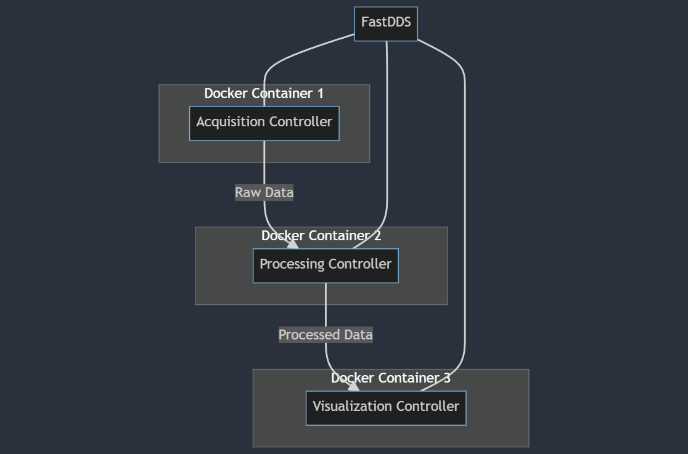

# Echo-sounder System

## Overview

This echo-sounder system is a distributed microcontroller software system implemented in C++. It consists of three main components: an Acquisition Controller, a Processing Controller, and a Visualization Controller. These components communicate with each other using FastDDS (Data Distribution Service) and are containerized using Docker for easy deployment and scalability.

## System Architecture

The system is composed of three main controllers, each running in its own Docker container:

1. **Acquisition Controller**: Responsible for simulating or acquiring raw echo-sounder data.
2. **Processing Controller**: Receives raw data from the Acquisition Controller, processes it, and sends the processed data to the Visualization Controller.
3. **Visualization Controller**: Receives processed data and visualizes it (e.g., creating graphs or other visual representations).

These controllers communicate using FastDDS, which provides a publish-subscribe architecture for real-time data distribution.

## Architecture

The system architecture is as follows:



## Key Components

### 1. Data Structure (IDL)

The system uses a common data structure defined in an Interface Definition Language (IDL) file:

```idl
module EchoSounder {
    struct EchoData {
        long timestamp;
        sequence<float> rawData;
        sequence<float> processedData;
    };
};
```

This structure is compiled into C++ code using FastDDSGen during the Docker build process.

### 2. Acquisition Controller

- Simulates or acquires echo-sounder data.
- Publishes raw data using FastDDS.

### 3. Processing Controller

- Subscribes to raw data from the Acquisition Controller.
- Processes the raw data (e.g., applying filters, transformations).
- Publishes processed data using FastDDS.

### 4. Visualization Controller

- Subscribes to processed data from the Processing Controller.
- Visualizes the data (implementation details depend on specific requirements).

## Development and Deployment

### Development Environment

- The project uses a devcontainer configuration for consistent development environments.
- CMake is used as the build system.
- Each controller has its own `main.cpp` file and Dockerfile.

### Building and Running

The system can be built and run using either Docker Compose or individual Docker commands:

#### Using Docker Compose

```bash
docker-compose up --build
```

#### Building Individual Controllers

```bash
docker build -t echo-sounder-acquisition -f src/acquisition_controller/Dockerfile .
docker build -t echo-sounder-processing -f src/processing_controller/Dockerfile .
docker build -t echo-sounder-visualization -f src/visualization_controller/Dockerfile .
```

#### Running Individual Controllers

```bash
docker run --name acquisition-controller --network host echo-sounder-acquisition
docker run --name processing-controller --network host echo-sounder-processing
docker run --name visualization-controller --network host echo-sounder-visualization
```

## Contributing

Contributions to this project are welcome! Please fork the repository and submit a pull request with your changes.

## License

This project is licensed under the MIT License - see the LICENSE file for details.